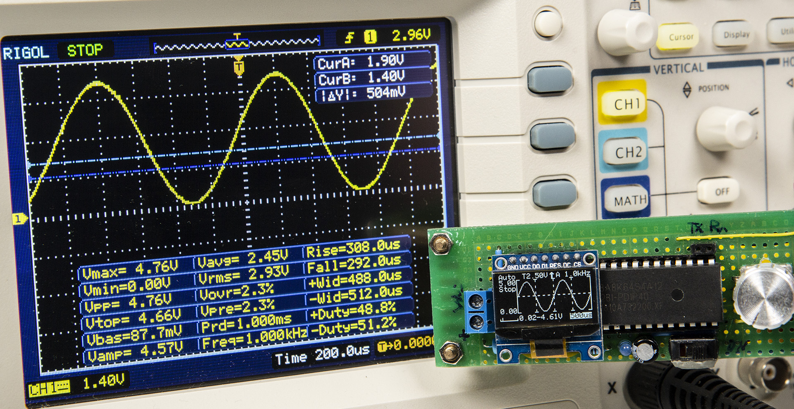

# Mini-DSO  
## Preview  
This is a simple oscilloscope made with STC8A8K MCU. Only servral components and easy to bulit. The functions could cover simple measurement. 
  
## Specification  
* MCU: STC8A8K64S4A12 @27MHz  
* Display: 0.96" OLED with 128x64 resolution  
* Controller: One EC11 Encoder  
* Input: Single Channel  
* Sec/div: 500ms, 200ms, 100ms, 50ms, 20ms, 10ms, 5ms, 2ms, 1ms, 500us, 200us, 100us  
*`100us only available in Auto Trigger Mode`*  
* Voltage Range: 0-30V  
* Sampling Rating: 250kHz @100us/div  
## Material list  
  
* STC8A8K64S4A12 MCU x 1  
* SSD1306 OLED(SPI) x 1  
* Resistor:  
  * 1W 10k x 1  
  * 1/4W 2k x 2  
  * 1/4W 10k x 1
  * 1/4W 5k x 1  
* Capacitor:  
  * 47uF x 1  
  * 0.01uF x 1  
* EC11 Encoder x 1  
* Toggle Switch x 1  
* 2-Pin Terminal x 1  
* Socket Strip:  
  * 7-Pin x 1  
  * 2-Pin x 1  
* 3.7V Li-ion Battery  
* 5V Booster Module with charge management
* USB-TTL Downloader  
## Interface  
  
  
### Parameters in Main Interface:  
* Seconds Per Division: "500ms", "200ms", "100ms", "50ms", "20ms", "10ms","5ms", "2ms", "1ms", "500us", "200us", "100us"  
  *`100us only available in Auto Trigger Mode.`*
* Voltage Range: 0-30V.  
* Trigger Level: Trigger voltage level.  
* Trigger Slope: Trigger on Rising or Falling Edge.  
* Trigger Mode: Auto Mode, Normal Mode, Single Mode.  
### Status in Main Interface:
* 'Run': Sampling Running.  
* 'Stop': Sampling Stopped.  
* 'Fail': The Trigger Level beyond the waveform in Auto Trigger Mode.  
* 'Auto': Auto Voltage Range.  
### Parameters in Settings Interface:  
* PMode(Plot Mode): Show waveform in Vector or Dots.  
* LSB: Sampling Coefficient. Calibrate the sampling voltage by adjusting LSB.  
*`100 times of voltage dividing coefficient. e.g. the resistor for voltage dividing is 10k and 2k, calculate the voltage dividing coefficient (10+2)/2=6. Get the LSB = 6 x 100 = 600.`*  
* BRT(Brightness): Adjust OLED Brightness.  
## Operations  
  
All operations are completed by the EC11 Encoder. The input include single click, double click, long press, rotate and rotate while pressing. It seems a little complicated, don't worry, there are details below. The resources of this encoder have been almost exhausted. If there are new features, may need additional input component.  
### Main Interface - Parameter Mode  
* Single Click Encoder: Run/Stop sampling.  
* Double Click Encoder: Enter Wave Scroll Mode.  
* Long Press Encoder: Enter Settings Interface.  
* Rotate Encoder: Adjust parameters.  
* Rotate Encoder While Pressing: Switch between options.  
* Switch Auto and Manual Range: Rotate Encoder clockwise continuous to enter auto range. Rotate Encoder anticlockwise to enter manual range.  
### Main Interface - Wave Scroll Mode  
* Single Click Encoder: Run/Stop sampling.  
* Double Click Encoder: Enter Parameter Mode.  
* Long Press Encoder: Enter Settings Interface.  
* Rotate Encoder: Scroll waveform horizontally. (only available when sampling stopped)  
* Rotate Encoder While Pressing: Scroll waveform vertically (only available when sampling stopped)  
### Settings Interface  
* Single Click Encoder: N/A  
* Double Click Encoder: N/A  
* Long Press Encoder: Return to Main Interface.  
* Rotate Encoder: Adjust parameters.  
* Rotate Encoder While Pressing: Switch between options.  
## Functions
* Trigger Level: For repeating signal, trigger level could make it stable on display. For single-shot signal, trigger level could capture it.  
* Trigger Slope: Trigger slope determines whether the trigger point is on the rising or the falling edge of a signal.  
* Trigger Mode:
  * Auto Mode: Sweep continuous. Single click the encoder to stop or run sampling. If triggered, the waveform will be shown on the display and the trigger position will be put at the center of chart. Otherwise, the waveform will scroll irregular, and 'Fail' will be shown on the display.
  * Normal Mode: When complete pre-sampling, you can input signal. If triggered, waveform shown on the display and waiting for new trigger. If no new trigger, the waveform will be kept.
  * Single Mode: When complete pre-sampling, you can input signal. If triggered, waveform shown on display and stop sampling. User need to single click Encoder to start next sampling.  
  * For Normal Mode and Single Mode, be sure the trigger level has been adjusted correctly, otherwise no waveform will be shown on the display.  
* Indicator: Generally, the indicator on means the sampling is running. The more important use is in Single and Normal Trigger Mode, before get into the trigger stage, pre-sampling is required. The indicator will not on during pre-sampling stage. We should not input signal until the indicator comes on. The longer time scale selected, the longer waiting time of pre-sampling.  
* Save Settings: When exit settings interface, all parameters in settings and main interface will be saved in EEPROM.  
## Tutorial  
* First Version: How to bulit step by step.
  * Bilibili: https://www.bilibili.com/video/BV1ai4y1t79R  
  * YouTube: https://youtu.be/c6gBv6Jcz7w  
  * Instructables: https://www.instructables.com/id/Make-Your-Own-OscilloscopeMini-DSO-With-STC-MCU-Ea/  
* V0.3: Changes in new version, interduction of interface, operations and functions.
  * Bilibili: https://www.bilibili.com/video/bv1XV411k7UV  
  * YouTube: https://youtu.be/-8PadlS7c4c  
  * Instructables: https://www.instructables.com/id/Upgrade-DIY-Mini-DSO-to-a-Real-Oscilloscope-With-A/  
## Further plan  
Since there is sampling jumping issue in STC8A8K, and it is not so popular that hard to find. I decide to transfer this project to STM32. Meanwhile, I will try to find a simple way to measure negative voltage.
