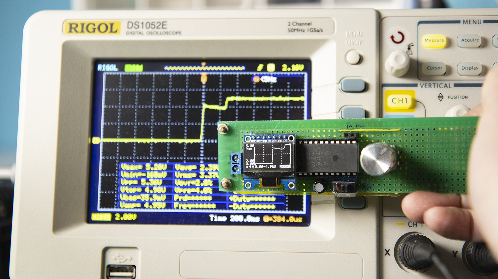
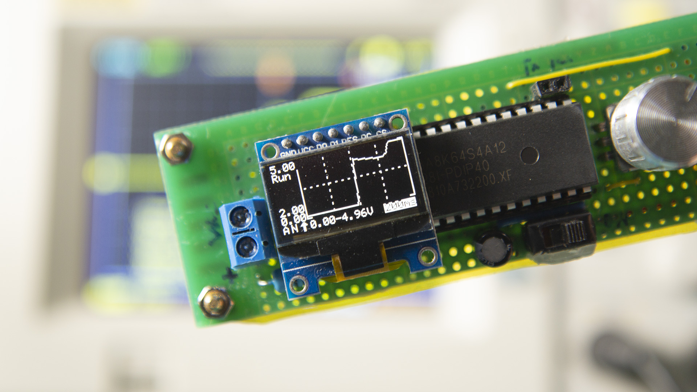
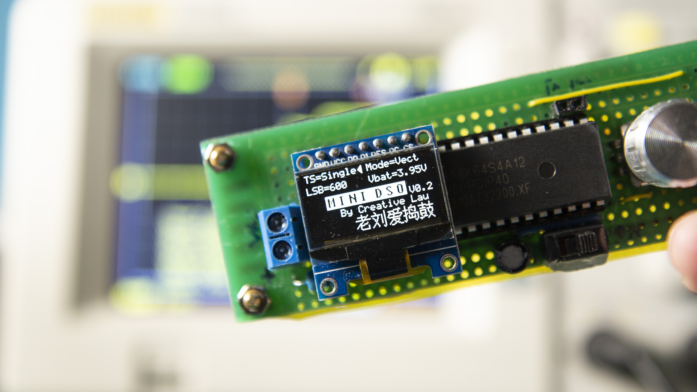

# Mini-DSO  
## Specification:
* MCU: STC8A8K64S4A12
* Display: 0.96" OLED with 128x64 resolution
* Controller: One EC11 Encoder
* Input: Single Channel
* Sec/div: 500ms, 200ms, 100ms, 50ms, 20ms, 10ms, 5ms, 2ms, 1ms, 500us, 200us, 100us
* 100us only available in Auto Trigger Mode
* Voltage Range: 0-30V
* Sampling Rating: 250kHz @100us/div

This is a simple oscilloscope made with STC MCU. 

You can use this Mini DSO to observe waveform.

Time Interval: 100us-500ms

Voltage Range: 0-30V

Draw Mode: Vector or Dots

Material list:

STC8A8K64S4A12 MCU x 1 

SSD1306 OLED(SPI) x 1

Resistor: 

1W 10k x 1 

1/4W 2k x 2 

1/4W 10k x 1

Capacitor: 

47uF x 1 

0.01uF x 1

EC11 Encoder x 1 

Tact Switch x 1 

2-Pin Terminal x 1

Socket Strip: 

7-Pin x 1 

2-Pin x 1

Li-ion Battery 

5V Booster Module

Bilibili Video Tutorial: https://www.bilibili.com/video/BV1ai4y1t79R

YouTube Video Tutorial: https://youtu.be/c6gBv6Jcz7w

Project information on Instructables: 
https://www.instructables.com/id/Make-Your-Own-OscilloscopeMini-DSO-With-STC-MCU-Ea/

2020-04-29 Update

Version 0.2(under test, not upload yet)

Add Normal Sweep and Single Sweep Function. This is a very useful function to observing the waveform mutation.

